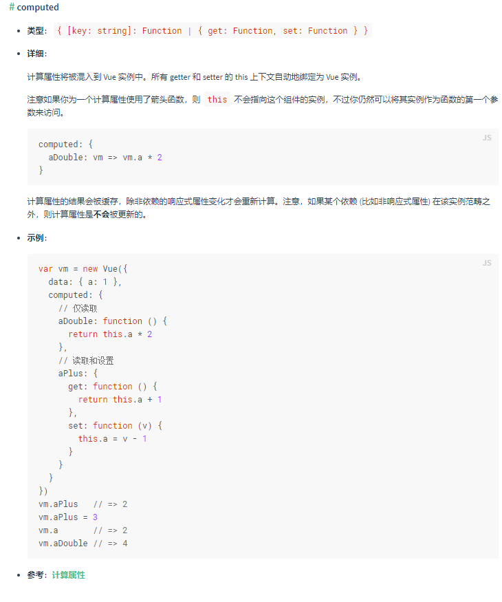
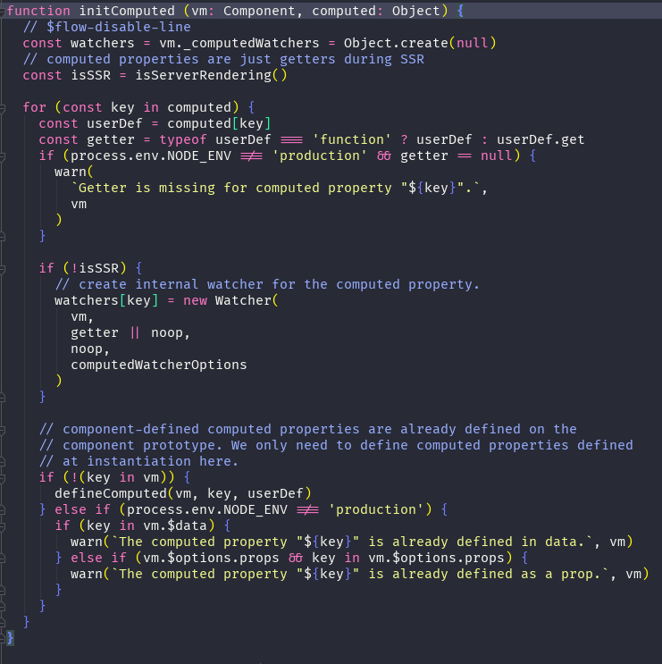
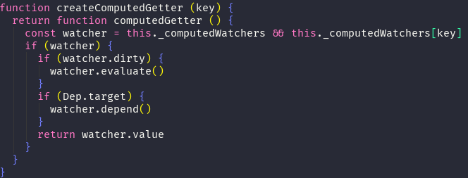

### computed官方API



### initComputed源码



在vue初始化computed属性时传入  **当前实例**    和 **computed对象**

1-为实例挂载**_computedWatchers** 属性

2-设置服务端渲染标记

3-循环computed中的属性

   ①根据官方文档的格式 统一 计算属性表达式（getter） 

   ②为计算属性创建内部观察属性**watcher**  

```javascript
_computedWatchers[key] = new Watcher(  
    vm,               		//实例
    getter || noop,         //计算属性的表达式
    noop,                   //回调函数 
    computedWatcherOptions  // {lazy：true})
```

​       返回属性大致为：

```
_computedWatchers[key] = {
   deps：[]
   lazy：true,
   dirty:true,
   getter,
   value:undefined
}
```

4-defineComputed

```
在这个步骤里是将计算属性的 get 定为 createComputedGetter 函数
```



在模板编译阶段 用到 computed属性时执行 createComputedGetter 函数获取 当前实例的_computedWatchers 属性中的计算属性

第一次获取时 dirty 为 true 立即执行 watcher.evaluate()  来获取返回值 

```
watcher.evaluate () {  
	this.value = this.get() 
    this.dirty = false
    }
-------------------------------函数执行后    
_computedWatchers[key] = {
   deps：[]
   lazy：true,
   dirty:false,     //修改dirty值
   getter,
   value:undefined  //this.get() 获取计算属性的值  
}
--------------------------------在获取计算属性的值的时候执行watcher中的get() 
 get () {
    pushTarget(this)                  //将自身设置为Dep.target
    let value
    const vm = this.vm
    try {
      value = this.getter.call(vm, vm)   //computed函数
      
 //执行computed函数时会 触发 computed 所用到的数据 
 
 //如果用到的数据是响应式的  数据会将 Dep.target（computedWatcher） 收集
 步骤如下：
 1- get数据触发
    dep.depend()====>watcher.addDep(dep)
    ==newDepIds.add(id)==newDeps.push(dep)==>dep.addSub(watcher)
 watcher中收集了数据的dep.id  dep.subs中收集了watcher
      
      
    } catch (e) {
      if (this.user) {
        handleError(e, vm, `getter for watcher "${this.expression}"`)
      } else {
        throw e
      }
    } finally {
      // "touch" every property so they are all tracked as
      // dependencies for deep watching
      if (this.deep) {
        traverse(value)
      }
      popTarget()
      this.cleanupDeps()
    }
    return value
  }
```
